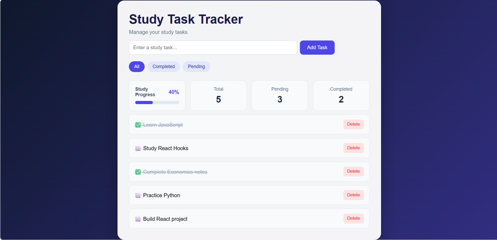
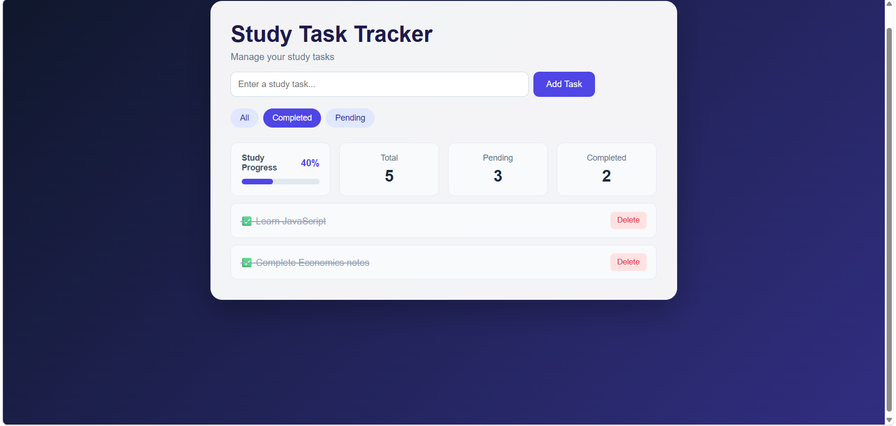
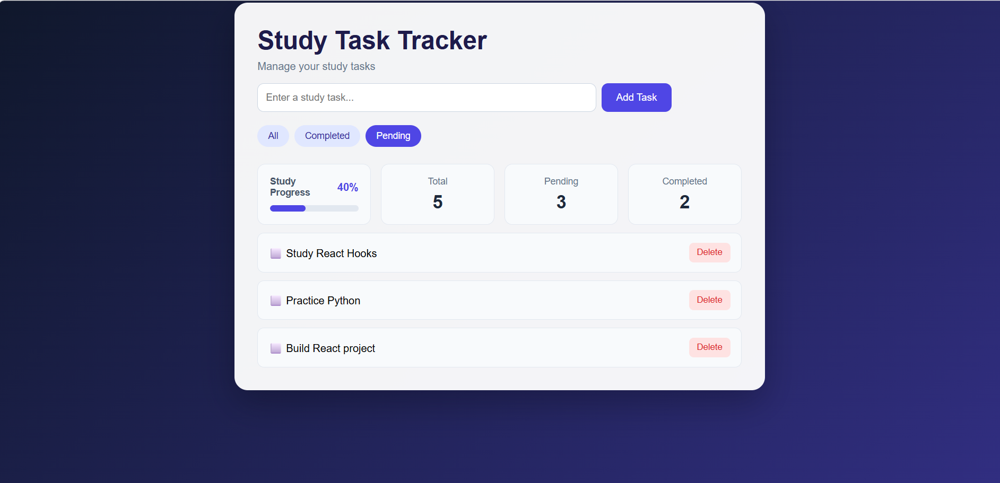

# Study Task Tracker

A simple single-page study task tracker built using React.

## Features

- Add new study tasks
- Add tasks using the Enter key
- Mark tasks as completed or pending
- Delete tasks
- Filter tasks by All, Completed, and Pending
- View total, completed, and pending task counts
- Track study progress with a progress bar
- Responsive design for smaller screens
- Empty state when there are no tasks

## Technologies Used

- HTML
- CSS
- JavaScript
- React
- Vite

## React Concepts Used

- Components
- JSX
- Props
- `useState`
- Event handling
- Conditional rendering
- Array methods such as `map()` and `filter()`

## How to Run

1. Clone the repository.
2. Open the project folder in VS Code.
3. Install dependencies:

```bash
npm install
```

4. Start the development server:

```bash
npm run dev
```

5. Open the local URL shown in the terminal.

## About the Project

This project was built as part of a web development learning task. The main goal was to understand the fundamentals of React and use them to create a functional single-page application.

## Screenshots

### Main Dashboard



### Completed Tasks



### Pending Tasks



## Demo

[Watch the demo video](https://drive.google.com/file/d/1ghSUW6QqBYKwkKfPh3pDBG-fdD41PiEn/view?usp=sharing)
